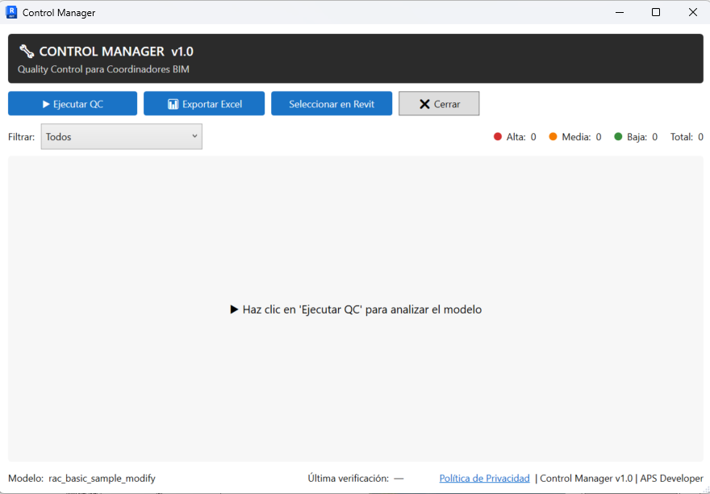
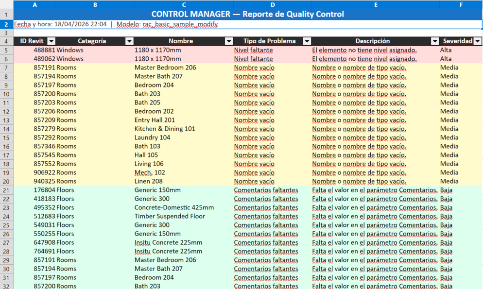
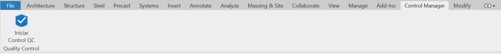

# Control Manager

Plugin de Quality Control para Autodesk Revit orientado a Coordinadores BIM que necesitan validar modelos de forma consistente y con trazabilidad.

## Que es Control Manager

Control Manager automatiza verificaciones QC comunes en modelos Revit y entrega resultados accionables para coordinacion BIM.
La revision ocurre sobre el modelo local, sin dependencia de servicios externos.

## Caracteristicas

- Deteccion automatica de incidencias BIM recurrentes.
- Exportacion a Excel con severidad visual para seguimiento.
- Seleccion directa de elementos problemáticos dentro de Revit.
- Compatibilidad con Revit 2023, 2024, 2025, 2026 y 2027.
- Ejecucion 100% local.

## Verificaciones incluidas

| Verificacion      | Severidad | Descripcion                        |
| ----------------- | --------- | ---------------------------------- |
| Nombres vacios    | Media     | Elementos sin `Name` o `Type Name` |
| Comments vacios   | Baja      | Parametro `Comments` sin valor     |
| Rooms sin cerrar  | Alta      | Habitaciones con area igual a 0    |
| Marks duplicados  | Media     | Elementos con el mismo `Mark`      |
| Niveles faltantes | Alta      | Elementos sin nivel asignado       |

## Compatibilidad

| Revit | Runtime            | Proyecto                |
| ----- | ------------------ | ----------------------- |
| 2023  | .NET Framework 4.8 | `ControlManager.Legacy` |
| 2024  | .NET Framework 4.8 | `ControlManager.Legacy` |
| 2025  | .NET Framework 4.8 | `ControlManager.Legacy` |
| 2026  | .NET Framework 4.8 | `ControlManager.Legacy` |
| 2027  | .NET 10            | `ControlManager.Net10`  |

## Instalacion

### Opcion A - Manual (desarrollo)

1. Descarga la version desde `releases/`.
2. Ejecuta `installer/install_bundle.bat` como administrador.
3. Reinicia Revit.
4. Verifica que el tab **Control Manager** aparezca en el ribbon.

### Opcion B - Autodesk App Store

Disponible proximamente.

## Requisitos

- Windows 10/11 (64-bit).
- Autodesk Revit 2023, 2024, 2025, 2026 o 2027.
- .NET Framework 4.8 para Revit 2023-2026.
- .NET 10 Runtime para Revit 2027.

## Stack tecnico

- C# con Revit API multi-version.
- WPF + MVVM.
- ClosedXML para exportacion a Excel.

## Capturas

## Roadmap

- Checks configurables por usuario.
- Soporte para modelos vinculados.
- Integracion con Autodesk Construction Cloud (ACC).
- Exportacion a PDF.

## Proceso de release

Guia rapida en `docs/release-workflow.md`.

## Politica de privacidad

El plugin opera localmente.
Consulta `docs/privacy-policy.html`.

## Licencia

MIT. Ver `LICENSE`.

## Contacto

Desarrollado por Mariano Luna  
LinkedIn: https://www.linkedin.com/in/marianorluna  
Email: contact@marianorluna.com
